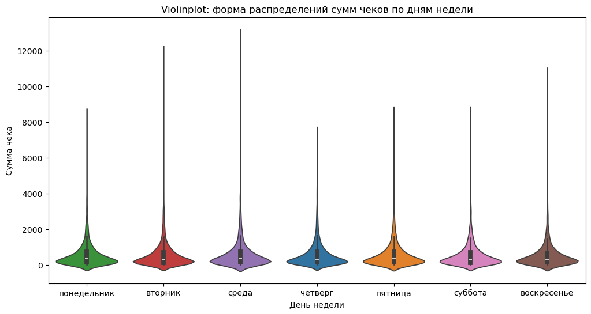
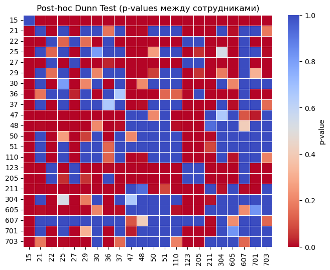
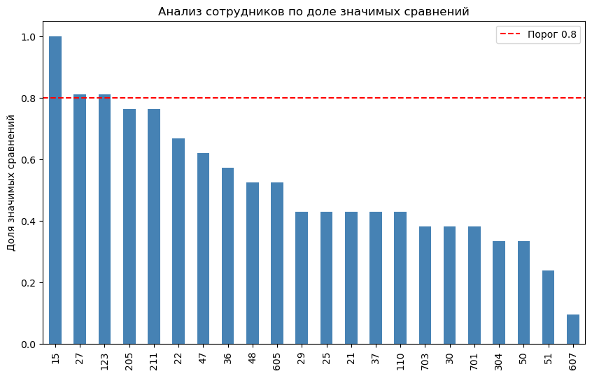
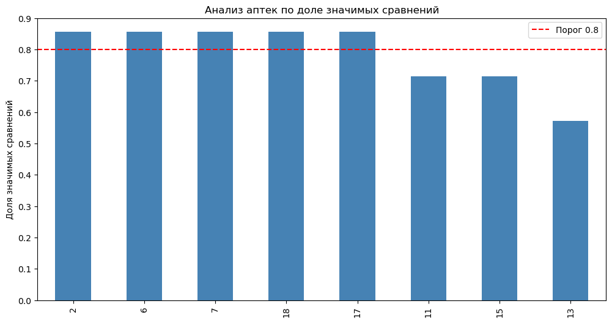
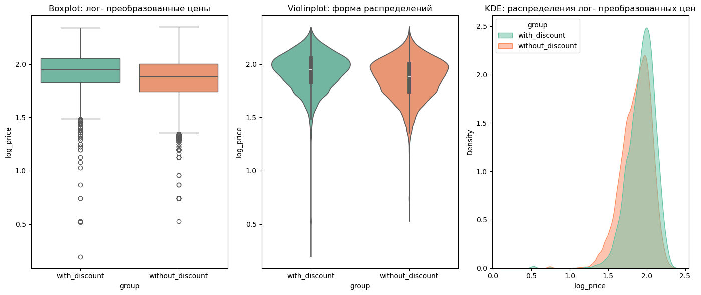
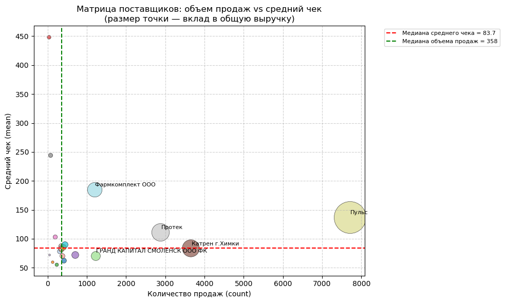
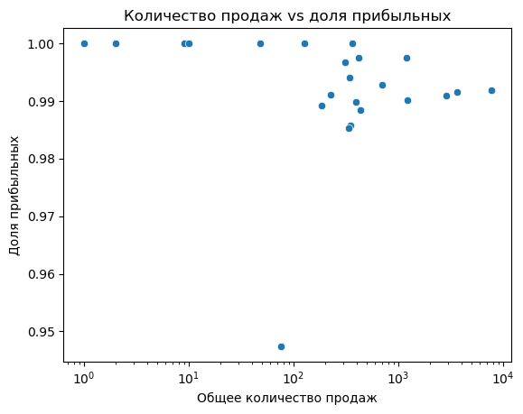

# Statistics Project   
"Анализ продаж аптечной сети: проверка гипотез"   

Содержание  
- [Описание проекта]()
- [Данные]()
- [Гипотезы и результат]()  
    - [Гипотеза №1]()  
    - [Гипотеза №2]()  
    - [Гипотеза №3]()  
  
- [Дальнейшие шаги]()  
- [Допущения и оговорки]()  
- [Техническая информация о проекте]()  

#

## Описание проекта   
**Контекст**   
В условиях высокой конкуренции и необходимости повышения операционной эффективности аптечной сети, состоящей из восьми точек, расположенных в разных районах города, перед компанией стоит задача обоснованной оптимизации бизнес-процессов. При ограниченных ресурсах особенно важно понимать, какие факторы реально влияют на ключевые показатели — такие как выручка, средний чек и прибыльность.  

Для этого применяется методология статистического тестирования гипотез, позволяющая количественно оценить значимость различных источников вариации: формат оплаты, день недели, тип покупки (онлайн или офлайн), а также различия между аптеками, сотрудниками и поставщиками. Такой подход даёт возможность не опираться на предположения, а принимать решения, основанные на данных — например, в вопросах управления персоналом, ассортиментной политики или работы с поставщиками.  

Задача проекта заключается в формировании набора проверенных гипотез, каждая из которых помогает ответить на вопрос: где именно находятся точки роста и резервы для повышения эффективности сети.  

**Цель проекта**  
Цель проекта — с помощью методов статистического тестирования гипотез выявить ключевые факторы, влияющие на продажи и прибыльность аптечной сети. В рамках анализа проверяются гипотезы о влиянии формы оплаты, дней недели, типа закупки, скидок, а также различий между аптеками, сотрудниками и поставщиками. Используя методы статистического тестирования гипотез, анализируются, какие источники вариации в данных наиболее значимы — поставщик, сотрудник, аптека или категория прибыльности и т.д..  
  
**Период**  
Тестирование гипотез проводилось на данных о продажах за период с 1 мая по 9 июня 2022 года.  

## Данные  
Датасет представляет собой реальные исторические данные о продажах сети из 8 региональных аптек, расположенных в различных районах города. Данные представлены за период с 2022-05-01 по 2022-06-09 включительно и состоят из 22 колонкок и 45128 строк. Вся необходимая для работы информация о транзакциях содержится в таблице sales.

| Column                  | Description                             | Data Type      |
| :---------------------- | :-------------------------------------- | :------------- |
| DR_Dat 	                | дата покупки	                           | DATE           |
| DR_Tim 	                | время покупки	                          | TIME           |
| DR_NChk 	               | номер чека	                             | INT(4)         |
| DR_NDoc 	               | номер кассового документа	              | INT(4)         |
| DR_apt 	                | номер магазина (FK  shops)	             | INT(4)         |
| DR_Kkm 	                | номер кассового аппарата	               | INT(4)         |
| DR_TDoc 	               | вид документа	                          | VARCHAR(100)   |
| DR_TPay 	               | форма платежа (18  безнал, 15 нал)	     | INT(4)         |
| DR_CDrugs 	             | артикул товара	                         | INT(4)         |
| DR_NDrugs 	             | название товара	                        | VARCHAR(100)   |
| DR_Suppl 	              | поставщик	                              | VARCHAR(100)   |
| DR_Prod 	               | производитель	                          | VARCHAR(100)   |
| DR_Kol 	                | кол-во проданного товара                |	FLOAT(8)       |
| DR_CZak 	               | закупочная цена	                        | FLOAT(8)       |
| DR_CRoz 	               | розничная цена	                         | FLOAT(8)       |
| DR_SDisc 	              | сумма скидки	                           | FLOAT(8)       |
| DR_CDisc 	              | код скидки	                             | TEXT           |
| DR_BCDisc 	             | штрихкод скидки	                        | TEXT           |
| DR_TabEmpl 	            | табельный номер сотрудника (FK - employee)  |	INT(4)     |
| DR_Pos 	                | номер позиции в чеке	                   | INT(4)         |
| DR_VZak 	               | вид закупки (1 - обычный, 2 -  интернет-заказ)	| INT(4)  |

Комментарии к структуре чеков и расчёту скидок:  
- Одному чеку может соответствовать несколько строк в таблице продаж (1 товарная позиция = 1 строка). Чек можно определить как комбинацию dr_apt, dr_nchk, dr_dat.   
- Скидка (DR_SDisc) применяется не к каждой штуке товара (DR_Kol), а к итоговому количеству. Перемножать эти поля не нужно.   

## Гипотезы и результаты  
Проверяемые гипотезы  

| №  | Гипотеза и формулировки H₀ / H₁                                                                                                  | Результат         | Ноутбук              |
|----|----------------------------------------------------------------------------------------------------------------------------------|-------------------|----------------------|
| 1  | **Форма оплаты и средний чек**    H₀: Средний чек не зависит от формы оплаты (наличные / безналичные).   H₁: Средний чек различается в зависимости от формы оплаты. | H₀ отвергнута     | [hypothesis_01.ipynb](https://github.com/Advantl/Statistics_project/blob/main/notebooks/hypothesis_01.ipynb)  |
| 2  | **День недели и продажи**    H₀: Средний объём продаж одинаковый в разные дни недели.   H₁: Есть статистически значимые различия в продажах между днями. | H₀ не отвергнута  | [hypothesis_02.ipynb](https://github.com/Advantl/Statistics_project/blob/main/notebooks/hypothesis_02.ipynb)  |
| 3  | **Продажи по будням и выходным**    H₀: Средний объём продаж по будням и выходным одинаковый.   H₁: Есть статистически значимые различия в продажах по будням и по выходным. | H₀ не отвергнута  | [hypothesis_03.ipynb](https://github.com/Advantl/Statistics_project/blob/main/notebooks/hypothesis_03.ipynb)  |
| 4  | **Эффективность сотрудников**    H₀: Средние продажи сотрудников не различаются.   H₁: Существуют статистически значимые различия в эффективности сотрудников. | H₀ отвергнута     | [hypothesis_04.ipynb](https://github.com/Advantl/Statistics_project/blob/main/notebooks/hypothesis_04.ipynb)  |
| 5  | **Аптеки и выручка**    H₀: Средний чек не зависит от аптеки.   H₁: Есть аптеки, у которых средний чек статистически выше/ниже. | H₀ отвергнута     | [hypothesis_05.ipynb](https://github.com/Advantl/Statistics_project/blob/main/notebooks/hypothesis_05.ipynb)  |
| 6  | **Скидки и продажи**    H₀: Скидки не оказывают значимого влияния на продажи.   H₁: Скидки увеличивают продажи (средний чек). | H₀ отвергнута     | [hypothesis_06.ipynb](https://github.com/Advantl/Statistics_project/blob/main/notebooks/hypothesis_06.ipynb)  |
| 7  | **Тип закупки (обычная vs интернет-заказ)**    H₀: Средний чек одинаковый для обычных покупок и интернет-заказов.   H₁: Средний чек различается для обычных покупок и интернет-заказов. | H₀ отвергнута     | [hypothesis_07.ipynb](https://github.com/Advantl/Statistics_project/blob/main/notebooks/hypothesis_07.ipynb)  |
| 8  | **Различия в прибыли по поставщикам**    H₀: Средняя прибыль от продаж разных поставщиков одинакова.   H₁: Средняя прибыль различается в зависимости от поставщика. | H₀ отвергнута     | [hypothesis_08.ipynb](https://github.com/Advantl/Statistics_project/blob/main/notebooks/hypothesis_08.ipynb)  |
| 9  | **Доля прибыльных товаров у разных поставщиков**    H₀: Доля товаров, приносящих положительную прибыль, одинакова для всех поставщиков.   H₁: Есть различия в доле прибыльных товаров между поставщиками. | H₀ отвергнута     | [hypothesis_09.ipynb](https://github.com/Advantl/Statistics_project/blob/main/notebooks/hypothesis_09.ipynb)  |
| 10 | **Зависимость между поставщиком и категорией прибыльности**    H₀: Категория прибыльности не зависит от поставщика.   H₁: Категория прибыльности зависит от поставщика. | H₀ отвергнута     | hypothesis_10.ipynb  |

## Отчет 
Обозначения для статистических тестов:  
✔️ - Предпосылки выполнены, тест проведен.    
❌ - Проведение теста не представляется возможным из-за невыполнения необходимых предпосылок для его корректного применения.   

Exploratory Data Analysis (EDA):  
1. Аномально высокие значения сумм продаж не были исключены из анализа как выбросы. Вместо этого принято допущение, что данные значения отражают корпоративные закупки или иные формы крупных «натуральных» продаж и не являются результатом ошибок ввода или искажения данных.  

### Гипотеза №1.  

**«Форма оплаты и средний чек»**  
H₀: Средний чек не зависит от формы оплаты (наличные / безналичные). - 🔴 отклонена   
H₁: Средний чек различается в зависимости от формы оплаты.  

**Значимость проверки гипотезы для бизнеса:**   
Проверка зависимости среднего чека от формы оплаты (наличные vs безналичные) имеет практическую ценность для понимания поведения покупателей и оптимизации бизнес-процессов аптечной сети. Различия между способами оплаты отражают разные типы потребителей: безналичные транзакции чаще связаны с плановыми, крупными и комплексными покупками, тогда как наличные указывают на импульсный, повседневный спрос. Анализ этой зависимости позволяет точнее прогнозировать выручку, оптимизировать кассовые и логистические операции, а также формировать адресные маркетинговые и лояльностные стратегии с учётом предпочтений клиентов по способу оплаты.  

**Статистические тесты:**     
1. Kruskal-Wallis H-test ✔️   
    - Размер эффекта Cliff's Delta    
2. Student’s t-test (на логарифмически преобразованных данных) ❌   
    - Shapiro–Wilk test  
    - D’Agostino & Pearson test  
    - Levene's test   
    - Проверка скоса (skewness) и эксцесса (kurtosis)  
3. Welch's t-test (на логарифмически преобразованных данных) ✔️  

**Результаты:**
1. Статистические тесты Kruskal–Wallis и Welch t-test показали:  
•	p-value ≈ 0.000, различия между группами существуют, и они не случайны.   
   
2. Размер эффекта Cliff’s Delta = -0.086, эффект незначительный (negligible):  
•	То есть разница есть, но она очень мала по силе.  
Если взять случайного клиента, то вероятность того, что чек по карте будет выше, чем по наличке, лишь незначительно отличается от 50%.  

3. Средние значения:   
•	наличные: 548 ₽   
•	карта: 614 ₽   
Разница ≈ 66 ₽.  

**Значение для бизнеса:**  
Безналичные платежи ассоциируются с чуть более высоким средним чеком, но:  
•	эффект микроскопический;  
•	статистическая значимость получилась из-за большого объёма выборки (13k + 8k чеков), а не из-за реально ощутимой разницы.  

#

### Гипотеза №2.   
 
**«День недели и продажи»**  
H₀: Средний объём продаж одинаковый в разные дни недели. - 🟢 не отклонена   
H₁: Есть статистически значимые различия в продажах между днями   

**Значимость проверки гипотезы для бизнеса:**    
Изучение зависимости объёма продаж от дня недели имеет высокую практическую значимость для планирования и управления операционной деятельностью аптечной сети. Различия между днями могут отражать цикличность потребительского поведения — например, рост продаж перед выходными или в начале недели. Понимание этих закономерностей позволяет оптимизировать графики персонала, планировать поставки и запасы с учётом пиков спроса, корректировать рекламные кампании и акционные активности. В результате сеть может повысить эффективность распределения ресурсов и снизить издержки, сохраняя высокий уровень обслуживания клиентов.  

**Статистические тесты:**   
1. ANOVA ❌  
    - Shapiro-Wilk  
    - Kolmogorov-Smirnov  
    - Bartlett's test  
    - Levene's test  
2. Kruskal-Wallis ✔️   
    - Пост-хок Mann-Whitney (Holm correction)  

**Результаты:**   
    
*Форма распределений сумм чеков по дням недели*   

 

Статистический тест Kruskal–Wallis показал:  
•	p-value > 0.05, нет статистически значимых различий между днями недели   
•	Гипотеза H₀ "Средний объём продаж одинаковый в разные дни недели" не отвергнута.   
Это означает, что статистически значимых различий между распределениями сумм чеков по дням недели не найдено. Иными словами, продажи в понедельник, вторник, … воскресенье не различаются на уровне, значимом для статистики.   

**Значение для бизнеса:**   
С точки зрения статистики — нельзя утверждать, что день недели влияет на продажи.   
Возможно, есть небольшие тренды или колебания, но они не настолько сильные, чтобы пройти статистическую проверку. Текущий анализ показал: день недели не оказывает значимого влияния на продажи.   
    
#

### Гипотеза №3.     

**«Продажи по будням и выходным»**   
H₀: Средний объём продаж по будням и выходным одинаковый. - 🟢 не отклонена    
H₁: Есть статистически значимые различия в продажах по будням и по выходным.   

**Значимость проверки гипотезы для бизнеса:**    
Анализ различий в продажах между буднями и выходными днями имеет важное прикладное значение для управления операционными процессами и маркетинговыми активностями аптечной сети. Если продажи существенно различаются, это позволяет адаптировать стратегию работы — например, усиливать персонал и расширять ассортимент дежурных позиций в дни повышенного спроса или, напротив, оптимизировать ресурсы в периоды спада. Кроме того, результаты анализа могут использоваться для таргетирования акций и программ лояльности, ориентированных на стимулирование продаж в менее активные дни. Таким образом, понимание недельной динамики продаж способствует повышению эффективности бизнес-процессов и увеличению общей выручки сети.  

**Статистические тесты:**    
1. Mann–Whitney U-test ✔️   
    - размер эффекта Rank-biserial correlation   
2. Kruskal–Wallis test ✔️   
    - Размера эффект Epsilon squared (ε²)   

**Результаты:**  
Статистические тесты Kruskal–Wallis и Mann–Whitney U показали:   
•	p-value ≈ 0.061 означает, что при стандартном уровне значимости α = 0.05, различие не является статистически значимым.   
•	Даже если бы результат был статистически значим, размер эффекта крайне мал (и в Mann–Whitney, и в Kruskal–Wallis).  
•	Следовательно, различие между суммами чеков в будние и выходные дни почти отсутствует как в статистическом, так и в практическом смысле.  

**Значение для бизнеса:**   
Суммы покупок клиентов в будние и выходные дни практически не отличаются.  
•	Средний чек остаётся стабильным независимо от дня недели.  
•	Нет необходимости менять стратегию ценообразования, скидок или маркетинга в зависимости от типа дня.  
•	Акции или рекламные кампании, направленные на увеличение среднего чека, не требуют дифференциации по дням недели, так как поведение покупателей по чекам схоже.  

#

### Гипотеза №4.    

**«Эффективность сотрудников»**    
H₀: Средние продажи сотрудников не различаются. - 🔴 отклонена   
H₁: Существуют статистически значимые различия в эффективности сотрудников.    

**Значимость проверки гипотезы для бизнеса:**   
Анализ различий в эффективности сотрудников имеет ключевое значение для оценки результативности работы персонала и формирования системы мотивации. Если статистически подтверждается, что уровень продаж существенно различается между сотрудниками, это позволяет выявить как наиболее успешных продавцов, так и зоны для развития у менее результативных. На основе этих данных можно разрабатывать индивидуальные программы обучения, корректировать графики, а также внедрять справедливую бонусную систему, основанную на объективных метриках. Таким образом, проверка данной гипотезы способствует повышению эффективности персонала, улучшению качества обслуживания клиентов и росту финансовых показателей аптечной сети.   

**Статистические тесты:**    
1. ANOVA ❌  
    - Shapiro-Wilk  
    - Kolmogorov-Smirnov  
    - Bartlett's test  
    - Levene's test  
2. Kruskal–Wallis test ✔️
    - Пост-хок Dunn test (Bonferroni)  
3. Многофакторный дисперсионный анализ (ANOVA, тип II) ✔️  

> Оговорка:  
Для оценки статистической значимости вклада факторов «сотрудник» и «аптека» в объяснение вариации среднего чека была использована многофакторная линейная модель с последующим дисперсионным анализом (ANOVA, тип II). Несмотря на некоторые отклонения от предпосылок метода (включая гетероскедастичность, асимметрию и разбалансированные группы), тест был применён как диагностический инструмент для выявления значимых эффектов.

**Результаты:**  
Многофакторный дисперсионный анализ показал, что средний чек статистически значимо зависит как от личности сотрудника, так и от аптеки, в которой он работает. Поскольку большинство сотрудников закреплены только за одной аптекой, взаимодействие между факторами оценить невозможно — эффекты сотрудника и аптеки частично неразделимы. Следовательно, при анализе индивидуальных различий сотрудников необходимо контролировать влияние аптеки (например, с помощью многоуровневых моделей или поправки на средний чек точки продаж).   

Для идентификации сотрудников, чьи показатели статистически значимо отличаются от большинства остальных, был применён пост-хок тест Данна с поправкой Бонферрони к множественным сравнениям. На основании полученной матрицы значений p-value для всех парных сравнений между сотрудниками, для каждого сотрудника была рассчитана доля сравнений, в которых наблюдались статистически значимые различия (p < 0.05).
Сотрудники, для которых эта доля превышала заданный порог (80%), рассматривались как статистически аномальные. Такой подход позволяет выявлять сотрудников, поведение которых (по среднему чеку) существенно отличается от поведения большинства, что может указывать как на наличие систематических отклонений, так и на потенциальные особенности в выполнении работы. 

*Визуализация результатов пост-хок анализа Данна в виде матрицы p-value для парных сравнений между сотрудниками*   
   

*Анализ сотрудников по доле значимых сравнений*   
   

1. Средний чек по аптекам   
Низкий средний чек: аптеки 7, 18, 15 (≈ 440–530).   
Средний уровень: аптеки 11, 13, 17 (≈ 545–590).  
Высокий чек: аптеки 6, 2 (≈ 760–790).  
Разрыв между «дешёвыми» и «дорогими» аптеками превышает 70%, что указывает на существенную неоднородность.

2. Аномальные сотрудники   
Выявлены сотрудники, чьи продажи значимо отличаются от коллег в их аптеках:   
•	Сотрудник 15 в аптеке 11
•	Сотрудник 27 в аптеках 2 и 6
•	Сотрудник 123 в аптеке 2
    
Это может быть связано:   
•	с успешными техниками продаж (upsell/cross-sell),   
•	с риском несоблюдения стандартов (навязывание дорогих товаров).  
•	с различным уровнем среднего чека аптек  

**Значение для бизнеса**    
1. Неоднородность аптек     
•	Клиентские сегменты и ассортимент значительно различаются.  
•	Аптеки 2 и 6 работают в «премиум»-сегменте, аптеки 7 и 18 — в «эконом».  

2. Кластеры аптек   
•	Эконом (средний чек < 500)  
•	Средний сегмент (500–600)  
•	Премиум (> 750)

3. Аномалии сотрудников   
•	Сотрудники могут быть «звёздами продаж» (позитивный сценарий).  
•	Или создавать риски (жалобы клиентов, потеря лояльности).

**Рекомендации**   
•	Сегментировать аптеки по уровням среднего чека, установить разные KPI и стандарты для «эконом», «средних» и «премиум».  
•	Провести аудит аномальных сотрудников (структура чека, возвраты, жалобы).  
•	Лучшие практики продаж: если высокие чеки достигнуты корректными методами — использовать их для обучения остальных.  
•	Контроль рисков: ввести правила прозрачности рекомендаций и стандарты по ассортименту.  
•	Фокус на баланс: для «эконом»-аптек искать возможности повышения среднего чека (персонализированные рекомендации, допродажи).   

#

### Гипотеза №5.  

**«Аптеки и выручка»**   
H₀: Средний чек не зависит от аптеки. - 🔴 отклонена   
H₁: Средний чек зависит от аптеки — существуют аптеки, где он статистически выше или ниже среднего уровня.  

**Значимость проверки гипотезы для бизнеса:**  
Проверка различий среднего чека между аптеками позволяет оценить эффективность работы отдельных торговых точек и выявить влияние локальных факторов — расположения, потока покупателей, ассортимента, кадрового состава и стандартов обслуживания. Если различия статистически значимы, это указывает на неоднородность бизнес-процессов внутри сети и потенциал для оптимизации. Результаты анализа дают возможность определить лучшие практики высокоэффективных аптек и масштабировать их на другие точки, а также своевременно выявлять проблемные аптеки, требующие управленческого вмешательства. Таким образом, гипотеза имеет прямую практическую ценность для стратегического управления розничной сетью и роста совокупной выручки.  

**Статистические тесты:**
1. ANOVA ❌
    - Shapiro–Wilk test
    - Kolmogorov–Smirnov test 
    - Bartlett's test
    - Levene's test
2. Kruskal–Wallis test ✔️
    - Пост-хок Dunn test (Bonferroni)
    - Размер эффекта Eta squared
    - Размер эффекта Epsilon squared

**Результаты:**  
*Анализ аптек по доле значимых сравнений*  
  

Статистический тест Kruskal–Wallis показал значение p < 0.05. Это указывает на то, что различия в выручке между аптеками статистически значимы, и гипотеза H₀ (об отсутствии различий) отвергается. Однако показатели силы эффекта (~0.03) свидетельствуют о слабом размере эффекта, то есть различия между аптеками существуют, но они объясняют лишь небольшую долю общей вариации в данных.   

Пост-хок анализ показал, что аптеки № 2, 6, 7, 17 и 18 статистически значимо отличаются по уровню выручки от большинства остальных (различия наблюдаются более чем в 80% попарных сравнений). Эти аптеки являются ключевыми точками отклонения. Рекомендуется провести их детальный аудит: для успешных аптек — с целью выявления и масштабирования факторов успеха, для отстающих — для устранения узких мест.  

1. Аптеки №2 и №6  
•	Средний чек очень высокий (≈ 760–795 руб.),  
•	Но медиана сильно ниже (≈ 416–455 руб.),  
•	Значит, распределение продаж скошено: есть небольшое число крупных чеков, сильно тянущих среднее вверх.    
•	Эти аптеки не просто успешные — они, скорее всего, обслуживают особый сегмент (например, корпоративные закупки, дорогостоящие препараты).

3. Аптека №7 и №18  
•	Средний чек низкий (≈ 442–454 руб.),  
•	Медиана ещё ниже (≈ 221–244 руб.),  
•	При этом количество чеков большое (особенно у №18 — почти 5000).  
•	Это указывает на большой поток покупателей, но каждый чек небольшой, аптеки ориентированы на массовый сегмент, недорогие товары, "повседневные покупки".

4. Аптеки №11, №13, №15, №17  
•	Средний чек в диапазоне 529–592 руб.,  
•	Медиана 301–369 руб.  
•	Баланс между ценой и количеством чеков, без явных аномалий.  
•	Это можно считать "нормальной группой" с типичным профилем продаж.  

Пост-хок анализ и статистика продаж показали, что аптеки №2 и №6 значительно выделяются за счёт высокого среднего чека при умеренной медиане — вероятно, они формируют выручку за счёт отдельных крупных продаж (например, дорогостоящих препаратов или оптовых заказов).  
В противоположность им, аптеки №7 и №18 работают по массовой модели: они привлекают много клиентов, но средний чек остаётся низким, что указывает на специализацию в сегменте недорогих товаров.  
Остальные аптеки (№11, №13, №15, №17) имеют более сбалансированный профиль и представляют собой «среднюю норму» сети.  

**Значение для бизнеса**    
Средний чек статистически значимо зависит от аптеки, но размер эффекта слабый (η² ≈ 0.03). Это означает, что аптека действительно влияет на величину среднего чека, однако различия между точками не являются ключевым драйвером выручки — основное влияние оказывают другие факторы (например, индивидуальные особенности сотрудников или структура продаж).    
Различия между аптеками существуют, но они не указывают на системные проблемы в ценообразовании или продажах. Возможное направление анализа — изучение факторов, которые делают отдельные аптеки более прибыльными (локация, клиентский поток, состав корзины).  

**Рекомендации:**  
•	Для аптек №2 и №6 — изучить источники крупных чеков и рассмотреть возможность масштабирования (например, выделение premium-направления).  
•	Для аптек №7 и №18 — усилить стратегию повышения среднего чека (дополнительные продажи, апсейл, промо-пакеты).  
•	Для аптек со «средним профилем» — использовать как бенчмарк для выработки стандартов сети.  

#

### Гипотеза №6.  

**«Скидки и продажи»**  
H₀: Скидки не оказывают значимого влияния на продажи. - 🔴 отклонена  
H₁: Скидки увеличивают продажи (средний чек).  

**Значимость проверки гипотезы для бизнеса:**   
Анализ влияния скидок на продажи позволяет определить оптимальную стратегию ценообразования и оценить эффективность промоакций. Если скидки действительно повышают средний чек, это подтверждает их стимулирующую роль в поведении покупателей и помогает обосновать использование гибких маркетинговых механик. Однако важно оценить силу эффекта и его влияние на маржинальность: не каждая акция приводит к росту прибыли. Практическая значимость этой гипотезы заключается в возможности выработать сбалансированную промостратегию — выявить порог скидок, при котором повышается выручка без существенной потери маржи, а также определить, какие категории товаров и периоды наиболее чувствительны к ценовым стимулам.  

**Статистические тесты:**  
1. Welch t-test (на логарифмически преобразованных данных) ✔️  
    - Размер эффекта Cliff’s Delta  

**Результаты:**   
*Распределение сумм чеков после логарифмического преобразования*  
    

Статистический тест Welch t-test на логарифмически преобразованных данных показал:  
•	t-статистика = -26.99, p ≈ 6.4e-157, результат сильно значим.  
•	Это значит, что вероятность случайного различия крайне мала. Различия между группами реальны.  

Размер эффекта Cliff’s Delta показал:  
•	Δ = 0.216, малый, но не пренебрежимо малый эффект.  
•	Это значит, что вероятность того, что случайно выбранный чек со скидкой будет больше, чем чек без скидки, на ~21.6% выше, чем наоборот.  
Результаты показывают, что скидки статистически значимо повышают продажи (средний чек при скидках отличается от продаж без скидок, p < 0.001). Однако размер эффекта невелик (δ ≈ 0.22), что означает: влияние скидок на поведение покупателей существует, но ограничено — большинство продаж не демонстрирует резкого роста даже при наличии скидки.  

**Значение для бизнеса:**  
Скидки эффективны как тактический инструмент для стимулирования продаж, однако их влияние умеренное — массовое снижение цен не гарантирует пропорционального увеличения выручки.  
Чрезмерное использование скидок может снижать маржу без ощутимого роста оборота.  
Эффект вероятно гетерогенен по группам товаров или категориям клиентов — в некоторых сегментах скидки дают больший прирост.  
•	Скидки работают как стимул: клиенты покупают чуть больше (или дороже), чем без скидки.    
•	Но их влияние не настолько велико, чтобы опираться только на акции как на ключевой драйвер роста.  
•	Возможно, сочетание скидок с другими инструментами (мерчандайзинг, программы лояльности) даст больший результат.  

**Рекомендации:**  
1. Оптимизировать стратегию скидок — фокусировать промоакции на товарах с высокой эластичностью спроса и низкой маржинальной чувствительностью.    
2. Анализировать эффект скидок по категориям (товар, поставщик, аптека, форма оплаты) для выявления сегментов, где скидки действительно стимулируют рост.    
3. Использовать персонализированные скидки (например, по истории покупок или корзине клиента), чтобы увеличить отдачу при меньшем снижении цены.    
4. Включить фактор скидки в многофакторные модели продаж, чтобы отделить его влияние от сезонности, сотрудника и локации.    

#

### Гипотеза №7.  

**«Тип закупки (обычная vs интернет-заказ)»**  
H₀: Средний чек одинаков для обычных покупок (в аптеке) и интернет-заказов. - 🔴 отклонена  
H₁: Средний чек статистически различается между типами закупки.  

**Значимость проверки гипотезы для бизнеса:**  
Анализ различий среднего чека между обычными покупками и интернет-заказами имеет высокую практическую значимость для стратегического управления каналами продаж. Если средний чек интернет-заказов статистически выше, это указывает на потенциал онлайн-канала как драйвера выручки и возможность его дальнейшего масштабирования. Для бизнеса это означает необходимость оптимизации омниканальной стратегии: развития онлайн-платформы, интеграции с офлайн-точками, персонализации предложений и адаптации ассортимента под специфику интернет-покупателей. Кроме того, результаты позволяют корректировать маркетинговые бюджеты и операционные процессы — например, перераспределять усилия между онлайн- и офлайн-продажами с учётом их вклада в общую прибыльность.  

**Статистические тесты:**  
1. Welch t-test (на логарифмически преобразованных данных) ✔️  
    - Размер эффекта Cohen's d  
2. Mann–Whitney U test ✔️     
    - Размер эффекта Cliff’s Delta  

**Результаты:**   

Статистический анализ:  
Welch’s t-test (на лог-преобразованных данных)  
•	t = −38.31, p = 5.17 × 10⁻¹⁸⁴  
Mann–Whitney U test  
•	U = 2 779 566.5, p = 3.73 × 10⁻¹⁷²  
Оба теста (параметрический и непараметрический) подтверждают статистически значимое различие между типами закупок (p ≪ 0.001).  

Размер эффекта  
•	Cohen’s d = −1.23 (large)  
•	Cliff’s δ = −0.615 (large)  
Отрицательный знак указывает, что средний чек выше у онлайн-заказов, чем у офлайн-заказов.  

Онлайн-заказы имеют значительно более высокий средний и медианный чек по сравнению с офлайн-покупками. Различие не только статистически значимо, но и практически значимо — размер эффекта большой (Cohen’s d ≈ 1.2, Cliff’s δ ≈ 0.6).  
Это говорит о том, что формат онлайн-заказов привлекает покупателей, совершающих крупные целевые покупки, тогда как офлайн-покупки чаще носят мелкий или импульсивный характер. 

**Значение для бизнеса:**   

Проведённые статистические тесты подтвердили, что различие среднего чека между онлайн- и офлайн-продажами статистически значимо и эффект большой (|d| > 1), что говорит о системном влиянии формата покупки. 
•	Онлайн-канал демонстрирует высокий средний чек и может быть ключевым драйвером выручки при относительно небольшом количестве заказов.     
•	Офлайн-точки приносят больший объём продаж по количеству транзакций, но с низким средним чеком.  
•	Стратегически важно рассматривать эти каналы в связке, а не в конкуренции — каждый выполняет свою роль в структуре продаж.  

**Рекомендации**   

Основной потенциал роста среднего чека в офлайн-сегменте лежит в управлении поведением покупателя, а не только в ценовых инструментах. Целесообразно сконцентрировать усилия на создании комплексного клиентского опыта в аптеке — сочетание ассортимента, визуальной среды, коммуникации и персонализации. Это позволит снизить разрыв с онлайн-каналом и устойчиво увеличить средний чек без прямого давления скидками.  
1. Развивать онлайн-канал как высокомаржинальный сегмент, с акцентом на удобство оформления и ассортимент товаров с высокой ценой.  
2. Повысить средний чек в офлайн-магазинах, используя:  
    •	механики "комбо-наборов"¹ и апселлинга;  
    •	персонализированные скидки при достижении порога суммы (по аналогии с онлайн);  
    •	визуальное стимулирование² (товары-сопутствия, аптечные наборы).  
3. Сегментировать аудиторию онлайн-покупателей — определить, какие категории и бренды чаще входят в крупные заказы, и использовать эти данные для таргетированных кампаний.  
4. При анализе эффективности сотрудников, поставщиков и аптек учитывать, что тип закупки — сильный фактор, влияющий на размер чека.

*Комментарии к использованным терминам*  
Результаты анализа показали, что онлайн-заказы имеют существенно более высокий средний чек, чем покупки в аптеке.
Это может быть связано с тем, что онлайн-покупатель чаще делает осознанный, комплексный заказ (на несколько позиций сразу), тогда как офлайн-покупки носят импульсивный и локальный характер.
Чтобы сократить этот разрыв и повысить эффективность розничных аптек, можно использовать механики, усиливающие структуру и привлекательность офлайн-покупок.
Механики вроде комбо-наборов и визуального стимулирования позволяют приблизить офлайн-поведение к онлайн, создавая ощущение удобства, продуманности и выгоды, присущее интернет-покупкам.  

> 1. Механики «комбо-наборов»  
Суть: формирование тематических наборов взаимодополняющих товаров, продаваемых вместе по специальной цене.  
Такие решения стимулируют покупателя увеличить количество позиций в чеке и воспринимаются как забота о клиенте и удобство выбора.  

Примеры аптечных комбо-наборов:  

| Категория        | Пример набора                                    | Цель                                                 |  
| ---------------- | ------------------------------------------------ | ---------------------------------------------------- |  
| При простуде     | жаропонижающее + витамины + спрей для горла      | Повышение среднего чека за счёт комплексного решения |  
| Для родителей    | жаропонижающее + антисептик + детские пластыри   | Поддержка повторных и семейных покупок               |  
| Для красоты      | витамины для волос + шампунь + маска             | Рост cross-sell через сопутствующие товары           |  
| В дорогу         | обезболивающее + активированный уголь + пластыри | Увеличение сезонных и импульсных покупок             |  

Бизнес-эффект:    
Рост среднего чека на 10–25% за счёт кросс-продаж.   
Снижение времени принятия решения клиентом.   
Повышение воспринимаемой ценности бренда аптеки.  

> 2. Визуальное стимулирование и мерчандайзинг  
Суть: оформление торгового пространства и расположение товаров так, чтобы побудить клиента к дополнительным покупкам.  
Используются поведенческие принципы — внимание, доступность, напоминание о потенциальной потребности.  

Примеры:  

| Зона                        | Пример реализации                                              | Поведенческий эффект                       |  
| --------------------------- | -------------------------------------------------------------- | ------------------------------------------ |  
| **Кассовая зона**           | Витамины, пластыри, чай при простуде, леденцы                  | «Добавление по пути» (impulse buy)         |  
| **Сезонные стенды**         | «Готовься к осени», «Сезон аллергии»                           | Напоминание о возможной нужде              |  
| **Сопутствующие товары**    | Рядом с антибиотиками — пробиотики, рядом с тестами — витамины | Формирует доверие и ощущение заботы        |  
| **Готовые аптечки**         | Упакованные наборы «В дорогу», «Для семьи», «Домашняя аптечка» | Упрощает выбор и усиливает ощущение выгоды |  

Бизнес-эффект:   
Повышение вероятности импульсных покупок до +15%.  
Усиление восприятия аптеки как эксперта, заботящегося о клиенте.      
Снижение зависимости среднего чека от скидочных акций.  

Рекомендации для внедрения  
1. Внедрить мониторинг “составов чеков” — анализировать, какие группы товаров часто встречаются вместе.  
2. Создать линейку комбо-наборов под ключевые клиентские сценарии (ОРВИ, уход, путешествия и т.п.).  
3. Оптимизировать визуальную выкладку: сопутствующие товары должны быть расположены физически рядом.  
4. Использовать аналитику продаж для A/B-тестов — измерять изменение среднего чека после внедрения наборов или новых мерчандайзинговых решений.  

#

### Гипотеза №8.  

**«Различия в прибыли по поставщикам»**  
H₀: Средняя прибыль от продаж разных поставщиков одинакова. - 🔴 отклонена  
H₁: Средняя прибыль различается в зависимости от поставщика.  

**Значимость проверки гипотезы для бизнеса:**  
Проверка различий в прибыли по поставщикам имеет ключевое значение для оптимизации товарной политики и управления ассортиментом. Если статистически подтверждается, что прибыльность варьируется в зависимости от поставщика, это позволяет бизнесу целенаправленно формировать закупочную стратегию: усиливать сотрудничество с наиболее рентабельными контрагентами, пересматривать условия поставок и скидочные соглашения с менее эффективными, а также корректировать ассортимент в сторону товаров с большей маржинальностью. Кроме того, результаты анализа могут служить основой для разработки моделей прогнозирования прибыли и построения рейтингов поставщиков, что способствует более рациональному распределению закупочного бюджета и повышению общей финансовой эффективности аптечной сети.  

**Статистические тесты:**   
1. Kruskal-Wallis H-test ✔️    
    - Размера эффекта eta-squared       
    - Пост-хок Dunn test (Bonferroni)  

**Результаты:**

> Для обеспечения корректности статистического анализа поставщики с числом наблюдений менее 30 были объединены в одну категорию под названием "Другие", поскольку статистические методы требуют достаточного объёма данных в каждой группе.

 

*Интерпретация квадрантов (общая логика)*  
Если провести медианы по обеим осям, то график делится на 4 квадранта, каждый из которых отражает разную бизнес-стратегию взаимодействия с поставщиком.  

| Квадрант             | Характеристика                           | Бизнес-смысл                                | Стратегия                                                                 |  
|----------------------|------------------------------------------|---------------------------------------------|---------------------------------------------------------------------------|  
| I (право-верхний)    | Высокий объём и высокий средний чек      | Поставщики приносят основную прибыль        | Лидеры — приоритетное сотрудничество, условия сохранить               |  
| II (лево-верхний)    | Низкий объём, но высокий средний чек     | Товары дорогие, но продаж немного           | Перспективные — можно развивать продажи, расширять ассортимент        |  
| III (право-нижний)   | Высокий объём, но низкий средний чек     | Массовый поток, но низкая маржа             | Поддержка — нужны для оборота, но стоит оптимизировать закупочные цены |  
| IV (лево-нижний)     | Низкий объём и низкий средний чек        | Почти не дают прибыли                       | Слабые — кандидаты на пересмотр или исключение                        |  

Статистический анализ:  

Тест: Kruskal–Wallis H-test.  
•	H = 1297.24, p = 1.38 × 10⁻²⁶³  
Проверка показала статистически значимые различия между поставщиками, нулевая гипотеза отвергается.  

Размер эффекта:  
•	Eta squared (η²) = 0.061  
Эффект умеренной силы, что указывает на заметные различия в структуре прибыльности между группами поставщиков.  

Пост-хок анализ (Dunn test, Bonferroni correction):  
•	Обнаружено множество статистически значимых пар различий.  
•	Наибольшие различия зафиксированы между поставщиками с разными стратегиями ценообразования и ассортиментом.  

Анализ доли значимых сравнений (по аналогии с post-hoc heatmap):  
•	Поставщики «Пульс», «Фармкомплект ООО», «Протек», «ООО Континент», а также агрегированная группа «Другие»  
показали долю значимых различий выше 0.8.  
•	Это означает, что их структура продаж и прибыльности статистически чаще отличается от остальных поставщиков.  

Кластеризация по матрицам (продажи × прибыль):  
•	Визуализация по среднему чеку и объёму продаж выявила отдельный кластер крупных и высокоприбыльных поставщиков,  
а также кластер низкомаржинальных поставщиков, характерных для розничных аптечных сетей.  

При учёте вклада в общую выручку видно, что топ-3 поставщика обеспечивают непропорционально большую долю прибыли,  
формируя зависимость бизнеса от ограниченного числа партнёров.  

**Значение для бизнеса**   

1. Поставщики формируют неоднородный профиль прибыльности.  
Различия статистически значимы и имеют умеренный размер эффекта, что свидетельствует о существенных стратегических различиях в марже, условиях закупок и позиционировании.  

2. Существуют выделенные группы поставщиков:  
•	Высокоприбыльные: «Пульс», «Фармкомплект ООО», «Протек», «ООО Континент».  
Эти контрагенты обеспечивают стабильно высокий уровень маржи и оборота.  
•	Низкоприбыльные или нестабильные: ряд мелких и региональных поставщиков (в т.ч. в группе «Другие»).  

3. Концентрация прибыли:  
Основной вклад в маржинальный результат формируют 3–4 ключевых поставщика.  
Это создаёт зависимость сети от ограниченного числа партнёров и требует стратегического контроля условий работы с ними.  

**Рекомендации**  

1. Оптимизация портфеля поставщиков  
•	Провести пересмотр условий закупок и скидок для поставщиков, показавших статистически низкий уровень прибыльности.  
•	Рассмотреть возможность перераспределения закупок в пользу поставщиков из высокоприбыльного кластера.  

2. Пересмотр ассортиментной политики  
•	Проанализировать номенклатуру товаров у поставщиков с низкой рентабельностью.  
•	Исключить или ограничить товары, не обеспечивающие целевую маржинальность (например, по принципу Парето 80/20).  

3. Контроль зависимости от ключевых партнёров  
•	Разработать стратегию диверсификации поставок, чтобы снизить риск концентрации прибыли на ограниченном пуле контрагентов.  
•	Использовать показатели прибыльности по поставщику как один из KPI в системе закупочного планирования.  

4. Аналитический мониторинг  
•	Внедрить регулярный отчёт «прибыль по поставщику» с обновлением по периодам.  
•	Включить в него динамику средней маржи, объёма продаж и долю в общей выручке.  
  
#

### Гипотеза №9.  

**«Доля прибыльных товаров у разных поставщиков»**   
H₀: Доля товаров, приносящих положительную прибыль, одинакова для всех поставщиков. - 🔴 отклонена   
H₁: Есть различия в доле прибыльных товаров между поставщиками.  

**Значимость проверки гипотезы для бизнеса:**   
Анализ различий в доле прибыльных товаров между поставщиками имеет высокую практическую ценность для стратегического управления ассортиментом и закупками. Если выявляются статистически значимые различия, это указывает на неоднородность качества товарных предложений и эффективности поставщиков с точки зрения прибыльности. Такие результаты позволяют аптечной сети определить поставщиков с устойчиво высокой долей прибыльных позиций, что делает их приоритетными партнёрами, а также выявить тех, чьи товары систематически демонстрируют низкую маржу или убытки. На основе этого можно оптимизировать закупочную политику, сократить долю нерентабельных позиций, пересмотреть условия поставок и стимулировать развитие ассортимента в сторону более маржинальных категорий. Это повышает общую прибыльность и устойчивость бизнеса за счёт точечного управления ассортиментом по поставщикам.   

**Статистические тесты:**   
1. Monte-Carlo χ² (перестановочный) ✔️  
    - Пост-хок парные permutation-тесты (Holm, Benjamini–Hochberg)  

**Результаты:**  

*Анализ зависимости между количеством продаж и долей прибыльных позиций с использованием логарифмической шкалы*  

   

> Для обеспечения корректности статистического анализа поставщики с числом наблюдений менее 30 были объединены в одну категорию под названием "Другие", поскольку статистические методы требуют достаточного объёма данных в каждой группе.  

•	Общая проверка (Monte-Carlo χ²) показала, что связь между поставщиком и прибыльностью товаров не случайна (p ≈ 0.036).  
•	Пост-хок анализ уточнил, что эффект обусловлен в основном низкой результативностью “ООО Континент”.  
•	У остальных поставщиков доли прибыльных товаров практически идентичны.  
  
**Значение для бизнеса**     
(основываемся на p_perm < 0.05, но учитываем, что после поправок Holm/FDR значимых пар не осталось — поэтому говорим о тенденциях, а не строгих различиях)  
1. Поставщик ООО "Континент" стабильно выделяется как имеющий более низкую долю прибыльных товаров.  
- Он проигрывает по прибыльности (разница ≈ –4 … –5 п.п.) поставщикам:  
    - Фармкомплект ООО (p_perm = 0.0005)  
    - ЕАПТЕКА ООО (p_perm = 0.0010)  
    - Пульс, Авеста, ГК Надежда Фарм, Катрен г. Химки, Акцентмед, Протек, Норман, Магнит Фарма и др. — во всех случаях наблюдается отрицательная разница и p < 0.05 до коррекции.  
После поправки различия не остаются статистически значимыми, но тренд систематический и устойчивый.  

2. Остальные поставщики демонстрируют очень высокую прибыльность (от 0.985 до 1.0), и между ними различий практически нет.  
Это говорит о том, что рынок в целом однороден, а «Континент» — скорее исключение.  

3. Корректировка p-значений (Holm, FDR) сильно подняла значения, что указывает на множество сравнений и небольшие выборки, повышающие риск случайных различий.  
Следовательно, все выводы требуют осторожной интерпретации и дополнительной проверки на больших данных.  

**Рекомендации**  

1. Проверить бизнес-процессы и ассортимент поставщика “ООО Континент”:  
    - проанализировать, какие конкретно товары дают убыток;  
    - оценить условия закупок, наценки, скидки, оборачиваемость;  
    - рассмотреть возможность пересмотра условий сотрудничества или частичной замены поставщика.  

2. Сфокусировать мониторинг на динамике прибыльности “Континента” в следующих периодах — если тренд сохранится, это может быть системная проблема.  

3. Для остальных поставщиков — сохранить текущую политику взаимодействия, так как различий по прибыльности не выявлено.  

4. Рассмотреть укрупнение категорий или использование байесовских / робастных методов, если анализ будет повторяться на малых подвыборках (из-за чувствительности перестановочных тестов к редким ячейкам).  

#

### Гипотеза №10.  

**«Зависимость между поставщиком и категорией прибыльности»**  
H₀: Категория прибыльности не зависит от поставщика. - 🔴 отклонена      
H₁: Категория прибыльности зависит от поставщика.   

**Значимость проверки гипотезы для бизнеса:**   

**Статистические тесты:**   
1. Monte-Carlo χ² (перестановочный) ✔️   
    - Пост-хок парные permutation-тесты (Holm, Benjamini–Hochberg)  

---

Гипотеза → Подготовка данных (формирование выборок, eda) →  Тест(Методы анализа, Кратко о применённых техниках, Проверка предпосылок, Параметрические/непараметрические тесты, Пост-хок анализ ) → Визуализация → Интерпретация → Бизнес инсайты подробно.

## Дальнейшие шаги
- Какие ещё гипотезы можно проверить

## Допущения, оговорки и рекомендации  
1. Для интерпретации результатов метрик силы эффекта использовалось «правило больших пальцев» для η² / ε² (Cohen’s benchmarks, адаптированные):  
- ~0.01 - маленький эффект  
- ~0.06 - средний эффект  
- ~0.14 - большой эффект

2. Предполагается, что данные независимы.

Рекомендации по стандартизации и подготовке данных   
1. Для повышения качества анализа рекомендуется привести наименования поставщиков к единому стандарту. В частности, полные наименования юридических лиц, такие как «Индивидуальный предприниматель Кочанов Андрей Михайлович», целесообразно указывать в сокращённой форме, чтобы избежать их обрезки и обеспечить консистентность данных в базе.

## Техническая информация о проекте
- Стек
  
**Структура репозитория**   

Statistics_project/  
├── config/   
│   └── config.ini # Основной конфигурационный файл - скрыт   
│      
├── etl/  
│   ├── __init__.py    
│   ├── db_connection.py  # Получение данных из SQL   
│   └── data_cleaner.py  # Очистка данных  
│  
├── notebooks/   
│ ├── hypothesis_01.ipynb   
│ ├── hypothesis_02.ipynb   
│ ├── hypothesis_03.ipynb  
│ ├── hypothesis_04.ipynb   
│ ├── hypothesis_05.ipynb   
│ ├── hypothesis_06.ipynb   
│ ├── hypothesis_07.ipynb   
│ ├── hypothesis_08.ipynb   
│ ├── hypothesis_09.ipynb    
│ └── hypothesis_10.ipynb   
│         
├── visualizations/ # графики и таблицы    
├── requirements.txt  # Зависимости    
└── README.md # Описание проекта    
  
- Как воспроизвести   

